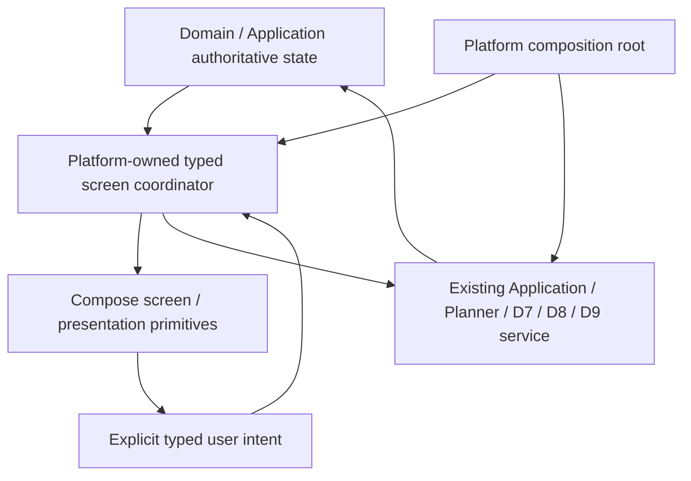
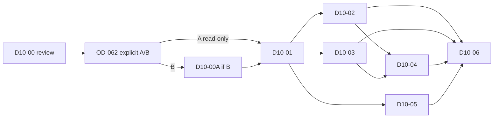

# D10-00 — Product / Information Architecture / UI Architecture Freeze

Status: **FROZEN / awaiting maintainer review**.
Task: **D10-00 ARCHITECTURE FREEZE IN REVIEW**; not COMPLETE.
Date: 2026-10-06.
Baseline: `feature/d9-02-agent-sync`, `378630cb63447443b02cae4599845b06c9353b5b`
([D9 final closure PR #29](https://github.com/fangbm/temvio/pull/29)).
Delivery branch: `docs/d10-00-product-ui-architecture-freeze`.

This packet freezes a reviewable presentation target under the maintainer's
D10-00 task instruction. It implements no UI. Human review of this packet gates
D10-01; OD-062 separately gates academic authoring. Passing CI is documentation
validation and predecessor regression evidence, not final product/visual acceptance.

## 1. Goal, authority and scope

Freeze product IA, platform navigation, a canonical design system, adaptive rules,
state ownership, application boundaries, accessibility and visual regression
strategy **before** a broad UI rewrite. [Capability inventory](../D10_CAPABILITY_INVENTORY.md)
records actual source evidence and missing surfaces rather than deriving capability
from roadmap aspirations or demo boards.

Binding authorities, in addition to the current task instruction:

- [READ_FIRST](../READ_FIRST.md), [Domain invariants](../DOMAIN_INVARIANTS.md),
  [open decisions](../OPEN_DECISIONS.md), [implementation contract](../IMPLEMENTATION_CONTRACT.md),
  [architecture diagrams](../ARCHITECTURE_DIAGRAMS.md), [module ownership](../MODULE_OWNERSHIP.md),
  [dependency policy](../DEPENDENCY_POLICY.md), [vocabulary](../UBIQUITOUS_LANGUAGE.md),
  [coding policy](../CODING_AGENT_POLICY.md), [roadmap](../ROADMAP_D5_D9.md).
- [Calendar decisions](../CALENDAR_DECISIONS.md), [academic invariants](../ACADEMIC_INVARIANTS.md),
  [academic decisions](../ACADEMIC_DECISIONS.md), [Planner decisions](../PLANNER_DECISIONS.md),
  [Planner rewrite decisions](../PLANNER_REWRITE_DECISIONS.md),
  [History/Sync decisions](../HISTORY_SYNC_DECISIONS.md),
  [Sync/security decisions](../SYNC_SECURITY_DECISIONS.md), [Agent decisions](../AGENT_DECISIONS.md).
- D5–D9 task and acceptance evidence linked in the inventory, including the
  [D9-03 freeze](D9_03_00_WEAR_AGENT_PROVIDER_FREEZE.md),
  [capability contract](D9_03_02_WEAR_CAPABILITY_NETWORK_STT.md) and
  [Watch runtime contract](D9_03_03_WEAR_AGENT_RUNTIME.md).

D10 changes presentation, navigation and interaction. D2–D9 remain authoritative
for entity meaning, time, Planner, mutation/audit/Undo, Sync/conflicts, security,
Agent history, Tools, permissions and provisioning. Historical slice exclusions
do not prohibit the current task's expressly authorized presentation architecture.

## 2. Baseline inspection conclusion

- Android's 1,276-line MainActivity and Desktop's 1,140-line Main.kt currently
  combine composition, multiple remembered feature states, forms, parsers and
  services in one Agenda/Day lazy-list surface. No final shell or shared theme exists.
- Wear's 305-line activity has Agenda/Agent switching and extracted runtime,
  session, readiness, network and speech adapters. It is a local replica, not a
  Phone display or remote Agent. Full mobile/desktop functionality is not its IA.
- Existing Compose/manual composition and typed Application/Planner/Agent services
  support the proposed architecture. Dependency inspection found no unavoidable
  state/navigation/DI framework. No architecture blocker was found for OD-060.
- Persistence and typed Sync vocabulary for Courses/Exams exist. Ordinary local
  create/edit commands do not. The inventory distinguishes this from legitimate
  Sync receive and explicit conflict-resolution application paths.

No new app/device run is claimed by this audit. Existing native/desktop/relay
acceptance and the real STT-service-absence limitation remain preserved.

## 3. OD-060 — approved target architecture

**RESOLVED FOR D10** by the current maintainer instruction; record synchronized in
[OPEN_DECISIONS](../OPEN_DECISIONS.md). Packet review remains pending.

CD-007's `PENDING` wording records the D5 acceptance-time OD-060 baseline;
this later D10 resolution supersedes that status for D10 without rewriting
the historical D5 architecture decision or implementation.

Use project-owned typed presentation architecture, Compose, explicit screen
coordinators, typed destinations and existing manual/platform composition. Do not
introduce project-wide Redux, MVI/MVVM framework, third-party navigation, DI,
service locator or a generic shared application store.



Screen coordinator contracts are feature-specific: immutable observable display
state, typed user intents, explicit operation results, loading/error handling and
lifecycle-owned jobs. They project facts and delegate commands; they do not own
Domain rules, permission decisions, Planner results, causal state or transactions.
Compose collects state and sends intents. Repository implementations and platform
handles are constructed only at the composition root, never discovered globally.

No screen or shared presentation module writes a DAO, uses a Room record as a
screen model, performs an unjournaled business upsert, manufactures a ToolResult,
or maintains competing committed state. Read-only repository ports, where needed,
remain behind application query/projection composition; source-conflict facts
cannot be bypassed for a cleaner list.

## 4. Canonical design-system ownership and module review

**Proposed later location: thin `:shared:ui`**, created only after packet/module
review in D10-01. No module, Gradle or dependency change in D10-00.

Inspection justifies one location: Android/Desktop duplicate feature presentation,
both use Compose Material3, all three platforms need a single semantic token
vocabulary, and the current settings/module graph has no canonical design-system
owner. Existing Domain/Application/Database/Agent modules should not acquire
Compose rendering merely to avoid a thin module.

| Owner | May own | Must not own |
| --- | --- | --- |
| Future `shared:ui` common presentation sources | Canonical tokens, theme primitives, semantic palettes, typography/spacing/shape/elevation/motion roles, immutable display values, formatting with explicit locale/timezone, accessibility helpers, Android/Desktop Compose primitives | Repositories/DAO/Room, network/crypto, Provider/AgentRunService, Planner execution, business mutations, secret storage, lifecycle, app navigation/back-stack or global state |
| Platform app | Shell, typed destinations/back-stack, screen coordinators, component adaptations, keyboard/touch/rotary integration, system accessibility/theme/motion inputs and lifecycle | Redefining shared business/permission/causal semantics |
| Existing Application/Planner/Agent/Sync | Current semantic queries, commands, truth and typed results | Depending on `shared:ui` or a platform screen |

Dependency direction is `apps -> shared:ui -> Compose/presentation primitives`,
with apps separately consuming existing services. Presentation-only models carry
stable source references and formatted display values, not repository handles.
Avoid a dependency on Database/Agent/network; map their typed results at the app
coordinator. Common formatting preserves Zoned/AllDay/Floating/DateOnly distinctions.
Wear maps the same semantic tokens onto Wear Material3 components; it is not forced
to render Android/Desktop primitives.

If module review rejects this thin module, the amendment must name a single
canonical shared source location before D10-01; duplicating token registries is
not an implicit fallback. Dependency additions, targets and exact pinned versions
remain subject to the existing policy. No new library is selected in this packet.

## 5. Presentation state and lifetime

| State | Authority / lifetime | Presentation responsibility |
| --- | --- | --- |
| Current Event/Task/academic facts, mutation history and causal/conflict state | Existing Application/persistence services | Subscribe/query, show typed facts and refresh after results; no UI-owned replicas |
| PlanBranch | Existing session-local Planner/application contract | Retain the exact preview within its session; Apply delegates revalidation. After process loss obtain a fresh preview; do not persist it as active Calendar |
| Agent thread, pending Tool/preview/result/action | Existing Agent state/runtime | Render persisted truth and confirm the exact pending identity/preview; no inferred success or repeated write on navigation/restoration |
| Local Provider/credential/permission/consent/preference | Existing independent local/security services | Explicit user controls call the owning service; credentials never enter navigation, UI snapshots, screenshots or logs |
| Selected destination/entity, Calendar viewport, filter, scroll, open panel and form/command draft | Platform coordinator/session | Ephemeral presentation state. A dirty draft survives a local layout change, but is not autosaved as a business entity or synchronized. Process loss may clear a draft with an honest notice; no new retention promise |
| ContextAnchor | Device/session-local selection | Pass a stable typed reference to existing context assembly. Never synchronize it or treat another device's selection as local intent |
| In-flight jobs / generations | Lifecycle-owned coordinator | Single-flight where required; discard stale screen/input generations. Loss of a UI listener is not a business rollback or permission to replay |

Navigation/resizing/theme changes never submit a form, Send a command, Confirm a
Tool or Apply a PlanBranch. On returning to a feature, refresh authoritative facts.
Do not keep a stale before-image as truth. Viewport timezone/locale/clock inputs
are explicit; a platform setting may supply them, not a hidden pure-logic read.

## 6. Final platform information architecture

Typed destination concepts below are presentation vocabulary, not new persisted
wire IDs or an implementation API. Each platform owns its graph and back-stack.
Do not use raw screen-name strings as navigation authority. Display labels may be
localized; routes carry typed IDs, viewport/mode and source references as needed.

### Desktop — Windows / Linux

Persistent sidebar order: **Today, Calendar, Tasks, Courses, Exams, Planner,
Agent, History, Insights, Settings**. No low-frequency primary item is hidden in
an unspecified grouping. Settings subdestinations: General/Appearance,
PlanningProfile, Sync/Security/Devices, Provider, local Agent permissions and
conversation sync/export. Conflict notices open the corresponding typed detail.

Standard/wide windows show main content plus optional selected-item detail/context
panel. Selection does not edit a fact. Narrow windows use the same destination
graph with a drawer/compact navigation control and detail as a separate route.
There is one selected primary destination, including when a detail panel is open.
The global Agent/Universal Command entry opens/focuses the existing Agent surface
with local ContextAnchor; it never implicitly Sends. Keyboard navigation reaches
sidebar, main content, details and explicit actions with visible focus; Escape
closes the top transient surface, not a committed operation or pending truth.

### Android

Primary order: **Today, Calendar, Tasks, Agent, More**. More gives explicit access
to **Courses, Exams, Planner, History, Insights, Sync/Security, Provider, Settings**.
Settings contains appearance, PlanningProfile, local Agent policy and distinct
V2 business/V3 conversation controls. No separate competing Provider/consent store.

Compact and wider-phone windows use bottom navigation and a single content pane;
forms/details push a route or an appropriate sheet with clear Back/Cancel. Medium
windows use a compact rail plus list/detail when height/space permits. Expanded
windows use a rail and bounded two-pane content. This is the Android graph with
the same five primary destinations, not Desktop's ten-item sidebar transplanted
to a phone. System Back unwinds the top dialog/detail and then the platform stack;
explicit discard protects dirty input. Resize retains route, selection and draft.

### Wear

Small graph: **Today/Upcoming, Agent, required status/setup, compact confirmation**.
Confirmation is tied to the actual pending Tool, not an arbitrary launcher action.
No full Courses/Exams/Planner/History/settings mirror. Show concise next-item and
material sync/readiness status, with details/confirmation reachable on-device.
Back/swipe closes the current presentation and cancels foreground continuation
as the existing lifecycle contract requires; it does not re-execute a command.

Text Agent entry remains independent of STT. With supported text input,
`aiEntrySupported` / `effectiveAiEntryEnabled` govern entry; ordinary C6
`providerReady` / `requestReady` still govern an actual request. Offline preserves
input capability and preference. Setup may remain accessible when entry is OFF.
Optional on-device STT produces only a draft candidate. `und` means no selected
language; unsupported/unverified/permission facts remain separate. Only voice/mic
availability changes when accepted speech conditions are unmet. No cloud/Phone
speech fallback, automatic mic permission, model download or speech-to-Send.

## 7. Adaptive/responsive freeze and acceptance sizes

Classify **available app-window dp**, not device names or physical pixels. Recompute
on resize, multi-window, orientation, insets and text scaling. Preserve typed
selection/draft state across layout changes. Pane count is presentation only.

| Platform class | Proposed frozen width | Layout / acceptance fixture sizes (dp) |
| --- | --- | --- |
| Desktop narrow | `< 900` | Single pane; drawer/compact nav; detail route. Test 640×720 and 800×600 |
| Desktop standard | `900 <= width < 1440` | Persistent sidebar, main content, optional detail if minimum readable widths fit. Test 1024×768 and 1280×800 |
| Desktop wide | `>= 1440` | Sidebar + main + selected detail/context; bounded content widths and no stretched paragraphs. Test 1440×900 and 1920×1080 |
| Android compact | `< 600` | Bottom nav, one pane. Test 360×800 and wider phone 480×900; landscape 800×360 forces single content pane |
| Android medium | `600 <= width < 840` | Rail; conditional list/detail, otherwise single pane. Test 600×960 and 720×960 |
| Android expanded | `>= 840` | Rail + two-pane where usable. Test 840×900, 1024×768 and 1280×800; larger windows keep readable maximums |
| Wear small round | 192×192 round fixture | Scroll/rotary-safe concise content, no clipped outer actions; actual emulator/device density recorded separately |
| Wear larger round | 227×227 round fixture | Same graph/semantics, more content without desktop density; test scaled text and round safe area |

At compact height `< 480dp`, suppress optional simultaneous panes and use scrollable
detail/confirmation routes. Test both sides of every width boundary, including
599/600, 839/840, 899/900 and 1439/1440, plus live resize with a dirty draft or
pending confirmation. Narrower-than-fixture windows still expose actions by scroll,
not hidden feature removal. Exact pane padding/max widths remain token tuning in
D10-01; they cannot weaken readable controls or the graph.

Android thresholds follow [Android window-size guidance](https://developer.android.com/develop/adaptive-apps/guides/use-window-size-classes).
Desktop thresholds and Wear fixture dimensions are this packet's presentation
proposal, not platform capability assertions or new library requirements.

## 8. Core screen inventory and interaction contracts

The [current capability matrix](../D10_CAPABILITY_INVENTORY.md) is the baseline.
The following is the target screen matrix; it does not claim those screens exist.

| Screen | Desktop / Android target | Existing authority / acceptance boundary |
| --- | --- | --- |
| Today | Schedule/upcoming, open or deadline-relevant Tasks, next FocusBlock, Planner/Agent entry and material conflict/sync notice | Compose existing read projections with explicit date/zone/status. No invented urgency score, background suggestions or duplicate Today database |
| Calendar Day/Week/Month | Mode/viewport selection, distinct source kinds, selected-item detail/context | Calendar application projection; no UI recurrence expansion, timezone coercion or new overlap policy |
| Tasks / Task detail-edit / Event detail-edit | Clear semantic fields, validation, explicit Save/Cancel and stale/conflict results | Existing Event/Task editing commands. No newly invented priority/effort/deadline/reminder defaults or delete support |
| Courses / Course detail / Exams / Exam detail | Final-quality list/detail READ_ONLY until OD-062; authoring controls are REQUIRES_FOUNDATION | Academic source facts, read projection, structured issues; all Exam schedule states visible in detail/list |
| Planner / PlanBranch preview | Full Replan and Local Reflow distinct; changes, reasons/issues, Apply/Cancel, Stale/Infeasible and fresh preview | D6 session-local branch, atomic Apply, exact base-state revalidation; no UI-generated schedule |
| History / Mutation detail | Typed origin, before/after changes, linked AgentAction where available, supported/unsupported/conflicting Undo | HistoryQueryService/UndoService. Undo availability derives from existing semantics; compensation keeps original evidence |
| Sync / Devices / recovery/setup | Actual offline/active/enrollment/epoch/catch-up/stopped reason and explicit retry/setup | Existing D8 lifecycle/security services; server reachability, upload acknowledgement or a held queue alone is not “synced” |
| Conflict resolution | Full component/candidates/provisional display/status; explicit valid user resolution | Existing D8 typed scope/DVV and D9-02 D2 boundary; no LWW/dismiss-as-resolved. Agent title resolution is NOT_IMPLEMENTED; do not invent DTO/clear path |
| Agent / Agent confirmation | Current thread, command draft, real ToolCall/ToolResult, permission, preview/confirm, stale/conflict/failed/success | Existing D9 runtime; unsupported structured Tools is chat-only with zero schemas; prose never commits |
| Provider | Explicit local config/profile/credential status and approved provisioning selection/comparison/setup | D9 Provider/provisioning/secure-store authority; no raw secret in saved presentation/navigation state; credentialed HTTP rejects, explicit non-loopback HTTP risk remains visible |
| Settings | Appearance, existing profiles/local policy/AI preference and independent Sync/consent controls | Existing owning services; UI state cannot silently enable consent, permission, provisioning or background execution |
| Insights | READ_ONLY explanation/history-derived views when authoritative input exists; otherwise honest NOT_IMPLEMENTED state | A new proactive/analytics service is REQUIRES_FOUNDATION, not implied by an empty card or mock board |

Wear final surfaces use the smaller graph in section 6, preserving existing local
confirmation, Tool truth, chat-only degradation, setup/readiness and no replay.

Calendar contextual actions may offer Edit, Discuss with Agent, Find a better
time, Reschedule, Create related task and Explain conflict only when the existing
typed application/Tool/Planner path supports them. Selection can prepare a draft
or ContextAnchor; it does not automatically run a Tool, move an item or claim a
Domain relationship that does not exist. Proposals remain visibly uncommitted.

### Calendar rendering review extension (OD-061)

D5 Agenda/Day remains authoritative and implemented; Week/Month are absent.
For D10 propose: a finite explicit date/zone viewport; Week at most seven visible
dates with lazy visible time rows; a separate AllDay/DateOnly band and explicitly
Floating labels; Month at most 42 visible date cells, bounded per-cell summaries
with an overflow detail route. Range intersections and source ordering consume
the application projection, never UI-recomputed recurrence/conflict truth.
Only visible rows/cells/details compose; no infinite calendar canvas or lifetime
history query. Each mode has a list/semantic accessible alternative and tests for
large fixture counts, long titles, cross-midnight/DST and explicit type labels.

This is a presentation rendering proposal for maintainer review. OD-061 currently
remains resolved for **D5 Agenda/Day**; before production Week/Month in D10-02,
review must explicitly accept this extension and synchronize its register/source.
If not accepted, that renderer is **BLOCKED_BY_DECISION (OD-061 extension)**;
independent shell/Day/Task work may proceed only after its own task is authorized.

## 9. Design system and entity visual language

Direction: clean, modern, calm, crisp hierarchy, restrained elevation, rounded
without playful decoration. Agent is reachable globally but does not dominate
every schedule/entity screen. Existing [promo](../../promo/README.md) and approved
stills are a north star, not a pixel copy or proof of current UI. Keep brand assets
as reference; do not freeze many new hex/pixel values before theme review.

| Token family | Canonical semantic roles / constraint |
| --- | --- |
| Color | `surface`, `surfaceContainer`, `surfaceElevated`, `textPrimary`, `textSecondary`, `accent`, `success`, `warning`, `danger`, `conflict`, `agent`, `calendarEvent`, `task`, `course`, `exam`, `focusBlock`; corresponding on-color/border/focus/disabled roles must meet contrast in Light and Dark |
| Typography | Display, screenTitle, sectionTitle, body, secondary, label, numeric/time; support scaling/localization, no truncated critical action or result |
| Spacing | Ordered compact/regular/comfortable layout gaps and content insets; density may adapt without shrinking interaction targets |
| Shape / elevation | Control/card/panel/dialog roles; elevation represents layering, never factual authority or implicit success |
| Motion | Enter/exit, focus/selection and state-change roles; reduced motion, deterministic screenshot mode, no motion-only success/conflict signal |
| Icon sizing / target | Small/standard/emphasis visual icons separated from hit target; labels/semantics for unlabeled controls |
| Content width | Form, reading, list and inspector readable limits; adaptive panes honor them rather than stretching text |
| Focus | Visible outline/highlight in both themes; selected versus keyboard-focused versus disabled are distinct |

Light **and** Dark are formal acceptance. Platform-local OS theme preference feeds
one canonical theme mapping; no semantic differences across color modes.

| Entity | Primary label / type affordance | Required secondary and state distinction |
| --- | --- | --- |
| Event | Title + Event label/icon | Zoned zone/time or AllDay dates or Floating wall-time; flexibility/pin and overlap indication where applicable |
| Task | Title + Task label/icon | Explicit status, remaining/unknown effort, priority and exact/date-only deadline; unscheduled is not a missing Event |
| Course / CourseSession | Course title + Course label/icon | Semester/rule/week/occurrence identity in detail; base versus effective schedule, room and cancellation/exception/issue facts |
| Exam | Title + Exam label/icon | Unscheduled / DateOnly / Exact, optional Course association; never a generic Event time substitution |
| FocusBlock | Task-related label + FocusBlock type marker | Planned duration/time, Task reference, flexibility/pin; does not claim actual WorkLog or Task completion |

Each also has explicit selected/focused state and textual/icon conflict indication.
Color is supplementary. Danger/destruction, conflict and uncommitted Agent/Planner
proposal all require labels/icons/state text; an Assistant narrative cannot restyle
a failed Tool as a successful committed entity.

## 10. Typed display/error vocabulary

Applicable feature states: **loading, empty, ready, offline, error, conflict,
stale, permission denied, unavailable**. Retain typed payload/reason/action and
last-known-data provenance where applicable. Do not force every screen into every
state or map all failures to one generic snackbar.

Distinguish calendar overlap from Sync conflict, chat-only from unavailable,
capability from user enablement, network route from Provider health, held outbound
from failed outbound, and pending Agent confirmation from committed success.
Only the owning service's result can claim success/undo/resolution/synced.
Show actionable redacted retry/setup reasons; never raw credential-bearing errors.
Network/provider/readiness restoration refreshes display only, never Agent replay.

## 11. Accessibility acceptance

Formal product gates for Light/Dark and all representative widths:

- Interactive elements have semantic names, role/state and logical traversal;
  icon-only actions are named, entity type/conflict/proposal is readable without color.
- Keyboard focus remains visible/unobscured. Sidebar/content/detail/modal order
  is predictable, modal focus returns to its trigger, and confirmations are reachable
  without a mouse. Inspect target-platform accessibility exposure, not screenshots alone.
- Android/Wear touch targets at least **48×48dp**, with non-overlapping hit areas.
  Desktop click targets also use at least 48×48 logical dp as this project's initial
  accessible control baseline; visual icons may be smaller. Dense read rows are not
  themselves targets unless actionable. [Android/Wear guidance](https://developer.android.com/training/wearables/accessibility).
- Project contrast targets: normal text at least **4.5:1**, essential component/focus
  cues **3:1** against adjacent surfaces. Focus/selection cannot rely on color alone.
  These adopt applicable [WCAG 2.2](https://www.w3.org/TR/WCAG22/) criteria as review
  targets, not an automatic claim of whole native-app WCAG conformance.
- Test 100% and 200% font scaling / equivalent platform settings, long localized
  labels and display scaling. Content/confirmation text remains scrollable; controls
  and status do not clip or overlap. Respect OS reduced-motion/animation settings.

| Platform | Required eventual evidence |
| --- | --- |
| Android | Compose semantics assertions plus TalkBack traversal/read/write-preview/Back, compact/medium/expanded, large font and target/contrast checks |
| Desktop Windows/Linux | Keyboard-only shell/form/preview/confirmation workflows; focus/resize tests; platform screen-reader names and reading order on each supported OS. Unsupported native accessibility exposure must be reported, not inferred from Compose semantics |
| Wear | Actual round Watch/emulator safe-area/scroll/rotary traversal, TalkBack/semantic names, large font, compact confirmation and optional speech-denied/unsupported paths. Absent recognizer is reported as unavailable, never physical STT success |

D10-00 runs none of this new platform acceptance; D10-06 owns final evidence.
If a platform cannot meet a required path, surface a release/acceptance limitation
for review rather than declaring the gate green from a bitmap.

## 12. Screenshot / visual regression strategy

Use deterministic **screen/component presentation fixtures**, not flaky whole-app
screenshots as the only gate. Existing Compose UI-test infrastructure is the first
candidate; D10-01 chooses any exact pinned capture/diff dependency under the policy
before adding it. This packet adds no screenshot tool or dependency.

Fixture inputs: fixed typed IDs, clock, date/timezone, locale, fonts, width/density,
theme, animation frame, state/proposal/Tool result and navigation/selection. No live
network/Provider, secure-store credential, private user DB or random ordering.
Fakes stop at presentation inputs; they never count as business execution evidence.

Minimum owned baseline set:

- Today populated/empty/offline; Calendar Day/Week/Month with every supported time
  kind, overlap/conflict/issue and selected detail; Task list/detail/edit validation.
- Courses/Exams read-only + unavailable authoring under the selected OD-062 option;
  Planner feasible preview/Stale/Infeasible; History diff/unsupported Undo/conflict;
  Sync stopped/held/offline and security setup; Provider configured/unavailable.
- Agent transcript with true ToolResult, exact confirmation, denied/conflict/stale,
  and chat-only; Wear Today/Upcoming, text entry with `und`/unsupported STT,
  offline/readiness/setup and confirmation on both round sizes.

Light/Dark × representative width classes are required for each applicable key
screen; boundary sizes/font scaling/keyboard focus add targeted fixtures rather
than an unbounded Cartesian whole-app suite. Golden files are platform-specific
with recorded renderer/OS/font/density/tool versions. Do not demand identical
Android/Desktop/Wear raster bytes from different native renderers.

CI stores expected/actual/diff and metadata. Changes require reviewed baseline
updates; never auto-accept snapshots. Text/geometry/semantic changes fail review;
only documented small rasterization tolerance/masks may be calibrated in D10-01,
with no masking of warnings, confirmations or failed results. Keep semantic-tree,
interaction and accessibility assertions alongside images. Business validity stays
in existing unit/integration/E2E suites; visual diffs cannot approve D2–D9 changes.

## 13. OD-062 — academic authoring decision required

Status: **PENDING / BLOCKED_BY_DECISION for Course/Exam authoring**.
Audit evidence is in [inventory section 3](../D10_CAPABILITY_INVENTORY.md).

| Option | Decision / effect |
| --- | --- |
| A | D10 Courses/Exams have final-quality list/detail/read UX only. No authoring buttons, no repository-upsert shortcut; no D10-00A. Explicitly record read-only scope in final acceptance |
| B — recommended | Before D10-01 UI work, authorize separate **D10-00A Academic Authoring Foundation**. Deliver validated Course/Exam create/edit and required academic scheduling authoring application commands, canonical IDs, cross-entity/time validation, atomic MutationCoordinator + D7 audit and existing D8 conflict/write semantics, tests and explicit compatibility review. Later UI calls those services only |

Recommendation B makes academic pages useful for authoring without bypassing the
transaction/audit/conflict boundary. It does not authorize new Domain defaults,
academic deletion/Undo support, a new merge policy, Tool schema or wire encoding.
If foundation design requires those, escalate separately. Option A is viable and
does not block unrelated presentation once maintainer selects it.

**Maintainer action requested on the Draft PR: choose A or B.** No implicit choice,
no D10-00A implementation, and no promotion of this pending decision to resolved.

## 14. Planned decomposition and execution dependencies

Entry roots stop growing as all-feature screens. Later decomposition:

```text
platform composition root
    -> app shell + typed destination/back-stack
    -> feature screen coordinator
    -> immutable presentation state + Compose screen
    -> feature dialogs/sheets
```

Extract by feature while retaining existing semantic service composition and
lifecycle ownership. No generic global store or DAO-writing coordinator. This
packet performs no extraction.

| Slice | Scope / dependency gate |
| --- | --- |
| D10-00 | This docs-only freeze; FROZEN / awaiting maintainer review |
| D10-00A | Academic Authoring Foundation, only if maintainer explicitly selects B and approves its task; precedes D10-01 under B |
| D10-01 | Design System + App Shell; after D10-00 review and OD-062 selection (plus accepted D10-00A under B); review thin module/targets, exact dependency/capture choices |
| D10-02 | Today / Calendar / Tasks / Academic; after shell, selected academic foundation/read-only boundary and OD-061 Week/Month extension review |
| D10-03 | Planner / History / Sync / Settings; after shell and relevant projections/navigation, preserving earlier semantic services |
| D10-04 | Agent Product Surface; after shell and required detail/preview/context surfaces; shared D9 execution unchanged |
| D10-05 | Wear Final UX; after canonical tokens and reviewed Wear graph; reuse accepted readiness/runtime/confirmation |
| D10-06 | Accessibility / Visual Regression / Final Acceptance; after all accepted product slices, with fixture/accessibility checks developed during each slice |



The graph expresses review dependencies, not authorization to start another slice.
No D10-01, D10-00A, D10 production UI or post-project fork starts in D10-00.

## 15. Validation and review acceptance

Required docs-only checks: `git diff --check`, local Markdown links/path existence,
current status/decision/scope consistency, reviewed current UI inventory and
source references. Confirm the PR contains Markdown only; no Kotlin/Gradle,
module/dependency, test, schema/migration, server, crypto or production change.
If repository CI triggers, wait and report its exact head/run. No additional
Android/Wear emulator acceptance is required for this packet.

Before D10-00 can be COMPLETE, maintainer review must accept IA, ownership,
coordinator/navigation architecture, thin shared-UI location, adaptive/a11y/visual
strategy and academic Option A/B. OD-061 renderer extension requires explicit
review before Week/Month production work; its existing D5 decision stays intact.

Scope fences: no Domain/Planner/D7/D8/D9/provisioning/Tool/policy changes, no
V3/Envelope/AAD/server/crypto change, no Room migration, no automatic Agent replay,
no academic upserts from UI, no cloud/Phone speech or new capability promised.
**OD-012 remains OPEN**, independent of D10 UI development/acceptance. This packet
does not claim production-sensitive-data readiness, all security gates closed,
or production release approval. Keep the delivery PR Draft; do not merge; await review.
